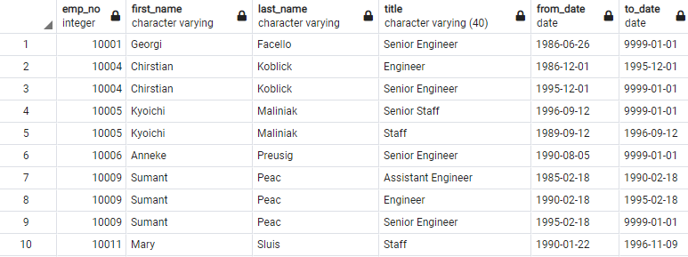

# Pewlett-Hackard-Analysis

## Overview & Purpose

PH has an upcoming retirement vaccum.  There will be many people retiring in the short-term.  Being able to determine the number of people retiring by position (title) and identifying personel that can mentor incoming employees is a good way to handle the challenge.

## Deliverable 1: Number of retiring Employees by Title

* New graphic with latest positions within the company
![unique_new_retire_titles] (Graphics/uniq_new_retire_titles.PNG)

## Deliverable 2: The Employees Eligible for the Mentorship Program

## Deliverable 3:  A written report on the employee database analysis
