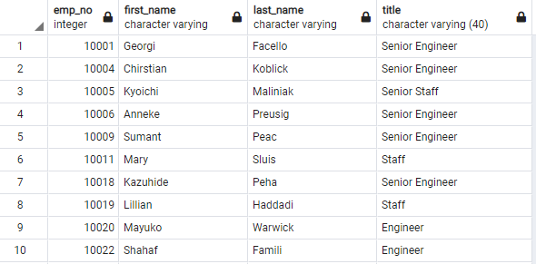
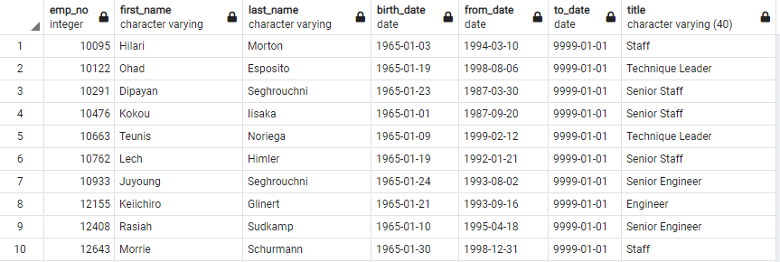
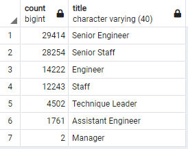

# Pewlett-Hackard-Analysis

## Overview & Purpose

PH has an upcoming retirement vaccum.  There will be many people retiring in the short-term.  Being able to determine the number of people retiring by position (title) and identifying personel that can mentor incoming employees is a good way to handle the challenge.  The goal is to examine the data by SQL and make queries to determine employees born between 1952 & 1955 (retirement age).

## Part 1: Number of retiring Employees by Title

#### New graphic with latest positions within the company (losing redundancy of names & giving a false count)

## Part 2: The Employees Eligible for the Mentorship Program

* There 1549 employees that are eligble for the mentorship by the current criteria of being born in the year 1965.

## Part 3:  Analysis
Below is a graphic showing the need for a mentorship training program due to the upcoming retirements by position.  There are clearly not enough mentors for the program.

#### Summary
* Age CAN be a determining factor, but should not be the only factor.  Years of service with company is likely more appropriate for mentorship.  This would expand the mentors in the program.
* Younger people in coming into the program would likely better identify with people closer to their own age.
* Expand the age range from one year to a four year range will identify well seasoned employees to create more mentors based on the current scheme for deciding who would be mentors.
